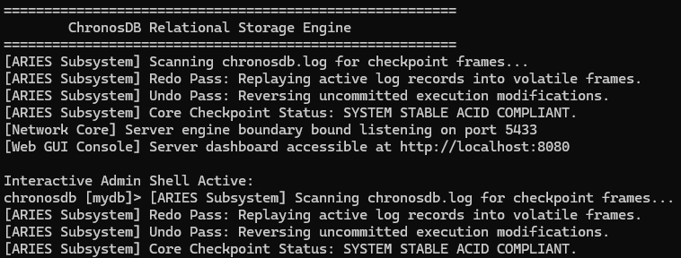
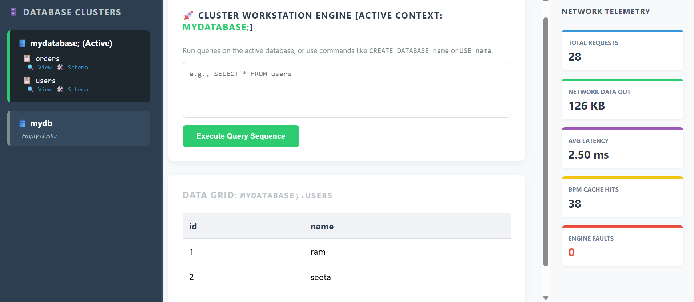
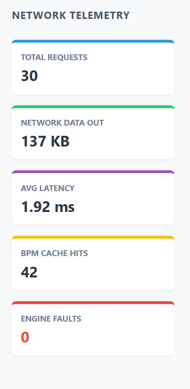
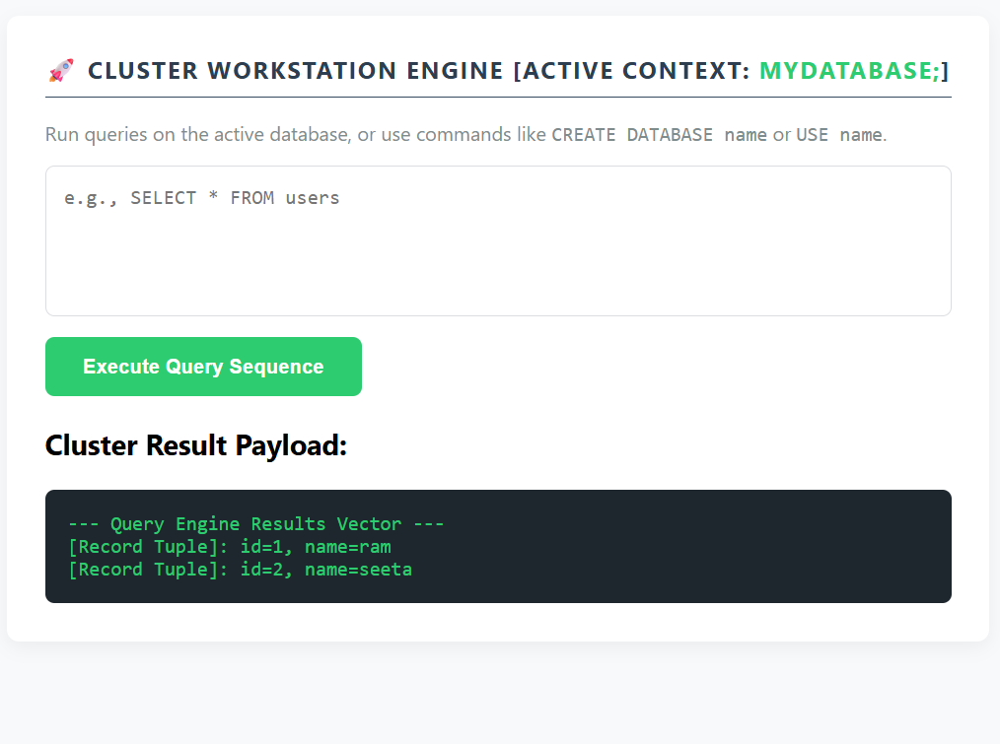

# ChronosDB


> **A transactional, ACID-compliant relational database management system (RDBMS) built from scratch in C++17.**
>
> ChronosDB implements a highly modular database engine architecture featuring **Slotted-Page Storage**, **LRU Buffer Pool Management**, **Multi-Version Concurrency Control (MVCC)**, and a **Volcano (Iterator Model) Query Execution Engine**. The system provides comprehensive client accessibility through a **multi-threaded TCP server**, an **interactive CLI shell**, and an **HTTP administration monitoring dashboard**.


---

## 📌 Table of Contents

1. [Project Overview](#-project-overview)
2. [Installation & Build Guide](#-installation--build-guide)
3. [Running ChronosDB & Ways to Use](#-running-chronosdb--ways-to-use)
4. [Supported SQL Commands](#-supported-sql-commands)
5. [System Features](#-system-features)
6. [Architecture Blueprint](#-architecture-blueprint)
7. [Project Directory Layout](#-project-directory-layout)
8. [Subsystem Implementation Details](#-subsystem-implementation-details)
9. [Technologies & Core Concepts](#-technologies--core-concepts)
10. [Current Project Scope](#-current-project-scope)
11. [Future Scope](#-future-scope)

---

# 📖 Project Overview

ChronosDB is an educational relational database engine developed to explore the internal architecture, resource constraints, and data isolation strategies present in modern database management systems.

The project combines multiple core database subsystems into a tightly integrated, layered architecture. The system stores variable-length record data using a **slotted-page storage engine** aligned to a fixed binary size, executes queries through a demand-driven **Volcano iterator execution pipeline**, and manages concurrent transactions using a hybrid approach of **MVCC Snapshot Isolation** and **Strict Two-Phase Locking (SS2PL)** to prevent write-write conflicts.

ChronosDB achieves absolute **ACID compliance** through an integrated transaction processing workflow:

- **Atomicity** — Transaction boundaries (`Begin` / `Commit` / `Abort`) guarantee that structural modifications succeed or fail as a single unit.
- **Consistency** — Strict schema type validation checks prevent unauthorized mutations or mismatched variable sizes from corrupting physical page files.
- **Isolation** — Hybrid execution mechanics combine tuple-level MVCC version verification against active runtime snapshots with exclusive transaction resource locks.
- **Durability** — Memory page operations are fully protected by an append-only Write-Ahead Logging (WAL) protocol that flushes records to disk before cache updates take effect.

---

# 🛠️ Installation & Build Guide

### Requirements

- **Compiler**: A C++17 compatible compiler toolchain (such as `g++` or `clang++`).
- **Libraries/Linkers**: Cross-platform network socket components (`lws2_32` library dependency required for Windows targets) and native POSIX threads (`pthread`) support.

### Compilation Command

Execute the following compilation sequence within your system terminal context to build the complete source codebase distribution into a unified, optimized native binary deployment:

```bash
g++ -std=c++17 -Wall -Wextra src/storage/disk_manager.cpp src/storage/buffer_pool_manager.cpp src/concurrency/lock_manager.cpp main.cpp -o chronosDB.exe -lws2_32
```

---

# 🚀 Running ChronosDB & Ways to Use

When launched, the compiled `chronosDB.exe` database cluster workflow automatically spawns three independent runtime interaction environments:

## 1. Interactive CLI Shell

Interact directly with the local active workspace database context inside your shell window. Execute raw SQL statements sequentially against the storage engine framework:

```text
========================================================
        ChronosDB Advanced Relational Storage Engine       
========================================================
[Network Core] Server engine boundary bound listening on port 5433
[Web GUI Console] Server dashboard accessible at http://localhost:8080

Interactive Admin Shell Active:
chronosdb [mydb]> CREATE DATABASE workspace;
SUCCESS: Database cluster 'workspace' spawned safely.

chronosdb [mydb]> USE workspace;
SUCCESS: Switched active storage context to database 'workspace'.

chronosdb [workspace]> CREATE TABLE workers (id INT, status VARCHAR);
SUCCESS: Table workers created with explicit typed schema layout.

chronosdb [workspace]> INSERT INTO workers VALUES (7, Active);
SUCCESS: Row inserted at Page 2 Slot 0
```

## 2. Multi-Threaded Programmatic TCP Server

ChronosDB registers a background multi-threaded network socket interface bound to:

```text
Port 5433
```

External applications can safely stream raw SQL statement character buffers over network connections. The server spins up an isolated, detached worker thread per client connection, passes incoming queries to the cluster routing layer, and returns formatted text rows over the socket channel.

## 3. Integrated HTTP Telemetry Dashboard

The administration web control studio boots an embedded HTTP listener accessible via your web browser at:

```text
http://localhost:8080
```

The dashboard generates an interactive UI rendering current schema matrices, data grids, and live engine analytics derived from internal atomic metrics counters:

- **Total Ingress Requests** — Measures global database query processing traffic.
- **Network Data Outbound** — Calculates data payload transmission volumes (KB).
- **Average Latency** — Employs rolling update filters (70% historical weight + 30% current weight) using high-resolution operational timers to track performance.
- **Buffer Pool Cache Hits** — Tracks frames served out of memory versus forced storage page replacements.
- **System Fault Telemetry** — Records runtime errors, validation mutation failures, and parsing errors.

---

# 💻 Supported SQL Commands

### Database Isolation Commands

```sql
CREATE DATABASE <name>; -- Allocates independent database physical file assets
USE <name>;             -- Transitions active cluster context to target engine
```

### Schema & Index Management

```sql
CREATE TABLE <name> (column_1 type, column_2 type, ...); -- Supported types: INT, VARCHAR
CREATE INDEX <index_name> ON <table_name> (<column>);     -- Builds secondary flat registry
DROP TABLE <name>;                                         -- Cascades removal of data and indexes
```

### Data Manipulation Language (DML)

```sql
INSERT INTO <table> VALUES (value_1, value_2, ...);
-- Performs type verification, serializes elements to CSV format, allocates slot
-- placement coordinates with transaction tracking metadata, and updates secondary indexes.

DELETE FROM <table> WHERE <column> = <value>;
-- Acquires exclusive resource locks, updates row expiration parameters (xmax),
-- and handles corresponding entry updates inside matching index spaces.
```

### Data Query Language (DQL) & Execution Pipelines

```sql
SELECT <fields> FROM <table> WHERE <column> = <value>;
SELECT <fields> FROM <table_1> JOIN <table_2> ON <col_1> = <col_2>;
SELECT <fields> FROM <table> COUNT(<target>) GROUP BY <group_column>;
SELECT <fields> FROM <table> ORDER BY <sort_column> DESC;
```


> **Note:** The query engine reads structural filtering conditions to determine index availability. If a secondary index exists on a matching column, it routes around linear table evaluations, automatically replacing long sequential scans with accelerated `IndexScanExecutor` passes.

---

# ⚡ System Features

### 📦 Storage Engine & Persistence

- **Slotted-Page Storage** — Packs variable-length record data inside fixed 4096-byte binary frames, preventing memory fragmentation.
- **Bi-File Infrastructure** — Decouples persistence logic into two separate file resources per database (a `.db` file for structured tables and catalogs, and an append-only `.log` file for transaction logs).
- **MVCC Record Slots** — Tracks structural transaction horizons (`xmin` for creation, `xmax` for deletion expiration marking) natively within each record slot header.

### 🧠 Buffer Cache Management

- **Strict Memory Constraints** — Restricts the maximum allocation of volatile memory to exactly 10 page frames to emulate real-world memory pressure and swapping states.
- **LRU Replacement Mechanics** — Leverages an internal Least Recently Used tracking list to select clean victim pages for eviction when memory fills up.
- **Pinning Protection Locks** — Manages page pin-counters to guarantee that active pages remain locked in memory and cannot be evicted while currently in use by active query execution operators.

### 🔒 ACID Concurrency Controls

- **Snapshot Isolation Model** — Enforces non-blocking read pathways by capturing runtime active transaction snapshot limits (`MVCCSnapshot`), allowing reading transactions to see a consistent snapshot of the data without blocking concurrent write operations.
- **Strict Two-Phase Locking (SS2PL)** — Protects outstanding mutations against write-write conflicts by trapping conflicting writers in a lock request queue until the blocking transaction explicitly completes its lifecycle.
- **Write-Ahead Logging (WAL)** — Ensures absolute durability by formatting structural transaction operations directly into append-only files on disk before modifying volatile cache structures.

---

# 🏗️ Architecture Blueprint

```text
                      Client Applications
               ┌──────────────┬──────────────┐
               │              │              │
               ▼              ▼              ▼
           CLI Shell      TCP Server    HTTP Dashboard
               \              |              /
                \             |             /
                 ▼            ▼            ▼
               DatabaseClusterManager
                          │
                          ▼ Allocates / Routes DB Context
                       DBEngine
                          │
                          ▼
           ┌───────────────────────────┐
           │       Compiler Layer      │
           │  Lexer → Parser → AST     │
           └───────────────────────────┘
                          │
                          ▼ Maps AST Parameters
           ┌───────────────────────────┐
           │     Execution Engine      │
           │  Volcano Iterator Model   │
           └───────────────────────────┘
                          │
                          ▼ Evaluates Version Horizons & Resource Locks
           ┌───────────────────────────┐
           │     Concurrency Layer     │
           │   MVCC + Lock Manager     │
           └───────────────────────────┘
                          │
                          ▼ Requests Virtual Memory Page Blocks
           ┌───────────────────────────┐
           │ Buffer Pool Manager (LRU) │
           └───────────────────────────┘
                          │
                          ▼ Serializes Dirty Frames / Appends WAL Entries
           ┌───────────────────────────┐
           │    Persistent Storage     │
           │    Disk Manager + WAL     │
           └───────────────────────────┘
```

---

# 📂 Project Directory Layout

```text
ChronosDB
├── main.cpp                        # System Entry Point (CLI Shell & Network bindings)
└── src/
    ├── common/
    │   └── types.h                 # Physical bounds, alias configurations, and status enums
    ├── compiler/
    │   ├── ast.h                   # Lightweight abstract statement parsing containers
    │   ├── lexer.h                 # Token classification tokenizer and normalizer
    │   └── parser.h                # Expression mapping components and DDL analyzers
    ├── concurrency/
    │   ├── lock_manager.h          # MVCC active snapshot tracking definitions
    │   ├── lock_manager.cpp        # 2PL resource synchronization & conditional wait logic
    │   ├── transaction.h           # Single transaction lifecycle property state maps
    │   └── transaction_manager.h   # Orchestrates transaction borders and logs WAL lines
    ├── execution/
    │   ├── catalog.h               # Core database metadata registry & data flattening engine
    │   ├── executors.h             # Volcano streaming operators (Scans, Joins, Sorts, Aggregations)
    │   └── engine.h                # Execution routing hub & multi-db tenant isolator
    ├── network/
    │   ├── tcp_server.h            # Programmatic multi-threaded raw connection listener
    │   └── http_dashboard.h        # Admin Web Studio designer and telemetry compiler
    └── storage/
        ├── page.h                  # Slotted-page memory definitions with physical MVCC headers
        ├── disk_manager.h/.cpp     # Binary filesystem direct random-access blocks managers
        ├── buffer_pool_manager.h   # Caching table frame tracking registries
        ├── buffer_pool_manager.cpp # Cache frame replacement logic & dirty flush materializers
        └── recovery.h              # ARIES checkpoint management engine frameworks
```

---

# 🔍 Subsystem Implementation Details

### Network Layer

Provides client entry gates across multiple entry strategies (CLI terminal prompts, raw socket client endpoints, and web panel routes). It intercepts query payloads asynchronously, detaching standalone thread loops for programmatic clients to process SQL strings without locking central system operation paths.

### Virtualization Layer

Implemented by `DatabaseClusterManager` and `DBEngine`. It isolates data resources by maintaining distinct storage boundaries for each database in the cluster registry. It routes statements based on context configuration changes (`USE <db_name>`), loads structured system catalogs from disk page 1 upon boot, and serializes schema properties back to disk on clean shutdowns.

### Compiler Layer

- **Lexer** — Scans query string characters to output structured tokens (`KEYWORD`, `IDENTIFIER`, `NUMBER`, `SYMBOL`) while converting all alpha keywords to uniform uppercase.
- **Parser** — Cleans target command blocks to extract properties for columns, projections, filters, joins, groupings, and sorting orders, storing the configuration inside structured `ASTStatement` parameters.

### Execution Layer

Operates on the Volcano demand-driven model. Each executor functions as an independent iterator block implementing `Init()` to compile execution states (such as building aggregate maps or materializing sort records) and yields streaming rows step-by-step on upstream `Next()` requests.

### Concurrency Layer

Tracks database snapshots via `MVCCSnapshot` structures to define transaction visibility limits before execution loops begin. It handles concurrency by evaluating row version horizons (`xmin`/`xmax`) against active transaction tables, and schedules exclusive locks via condition variables to resolve write-write contentions.

### Memory Layer

Coordinates in-memory page frame allocations through the `BufferPoolManager`. It manages pinned reference counts to protect active database pages from eviction during processing loops, and relies on an LRU eviction list to clean memory frames, automatically flushing modified dirty changes back to disk.

### Storage Layer

Manages physical data persistence. The `DiskManager` communicates with the underlying file system using fixed page offsets calculated from page IDs multiplied by `PAGE_SIZE`. The `Page` subsystem manages data packing using slotted configurations, growing slot definitions forward from the page header while packing the raw record text backward from the end of the block.

---

# 🛠️ Technologies & Core Concepts

- **Language Specification** — C++17 Toolchain Compliance Configurations
- **Relational Storage Strategies** — Slotted-Page Binary Serialization, Metadata Catalog Engine APIs
- **Transactional ACID Foundations** — Hybrid Multi-Version Concurrency Control (MVCC), Snapshot Isolation Horizon Maps, Strict 2PL Resource Access Scheduling, Write-Ahead Logging (WAL)
- **Query Execution Architectures** — Volcano Iterator Stream Operators, Flat Single-Page Index Acceleration
- **Volatile Cache Engineering** — LRU Page Replacement Lists, Reference-Count Caching Page Frame Pinning
- **Systems Infrastructure** — POSIX Thread Multi-threading, Cross-Platform Socket Implementations, Windows Winsock Linking Protocols

---

# 🎯 Current Project Scope

ChronosDB provides a complete, educational relational core that supports:

- A full end-to-end compilation and execution workflow running over thread-isolated TCP sockets, web interfaces, and local terminal prompts.
- Persistent, transactional data storage managing database records inside fixed 4KB blocks.
- Safe transaction isolation that preserves non-blocking reads while protecting active column mutations under strict snapshot scopes.
- Real-time diagnostic administration studios that pull performance statistics directly from internal atomic telemetry counters.

---

# 🔮 Future Scope

The project implements the foundational placeholders for transaction tracking and log analysis natively inside `recovery.h`. This architecture provides the ideal stepping stones for several system extensions, including:

- Completing the ARIES database crash recovery analysis, redo, and undo lifecycle loops.
- Upgrading the flat single-page index architecture into hierarchical, multi-level secondary B+ Tree structures using the existing `IndexHeader` page stubs.
- Expanding the SQL syntax parser to process complex nested subqueries and cost-based plan optimizations.
